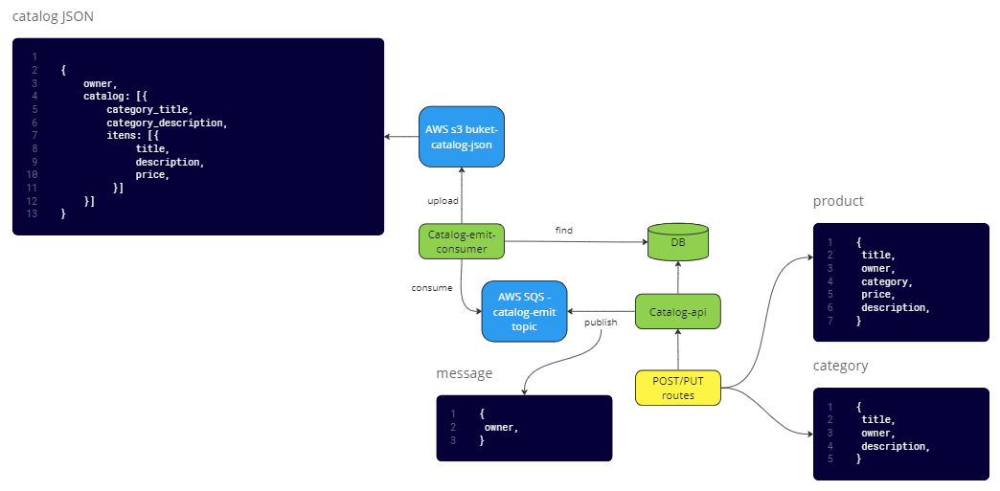

<h1>Backend Analyst Candidate Test</h1>

Dear developer,

Welcome to the Backend Analyst Candidate Test. This test aims to assess your general knowledge and development speed. Below, you will find the details and requirements for this test.

<strong>The Challenge</strong>

Your task is to develop an API using Node.js for a product catalog management system in a marketplace application. You should analyze and convert the following user stories into routes for the application:

<strong>User Stories:</strong>

<ul>
  <li>As a user, I want to register a product with its owner, so that I can access its data in the future (title, description, price, category, owner ID).</li>
  <li>As a user, I want to register a category with its owner, so that I can access its data in the future (title, description, owner ID).</li>
  <li>As a user, I want to associate a product with a category.</li>
  <li>As a user, I want to update the data of a product or category.</li>
  <li>As a user, I want to delete a product or category from my catalog.</li>
  <li>A product can only be associated with one category at a time.</li>
  <li>Assume that products and categories belong only to one owner.</li>
</ul>

<ul>
  <li>Keep in mind that this is an online product catalog, which means there will be multiple requests for editing items/categories per second, as well as accessing the catalog search endpoint.</li>
  <li>Consider the product catalog as a JSON compilation of all available categories and items owned by a user. This way, the catalog search endpoint does not need to fetch information from the database.</li>
  <li>Whenever there is a change in the product catalog, publish this change to the <code>catalog-emit</code> topic in the AWS SQS service.</li>
  <li>Implement a consumer that listens to catalog changes for a specific owner.</li>
  <li>When the consumer receives a message, search the database for that owner's catalog, generate the catalog JSON, and publish it to an AWS S3 service bucket.</li>
</ul>

<strong>You need to develop this test using the following technologies:</strong>

<ul>
  <li>MongoDB for the database.</li>
  <li>AWS SQS for the catalog change notifications.</li>
  <li>AWS S3 for storing the catalog JSON.</li>
  <li>Node.js for the backend.</li>
  <li>Express.js as the web framework.</li>
</ul>

<strong>Diagram representing the final structure of the project:</strong>

  

<strong>Instructions</strong>

<strong>To begin the test, fork this repository, create a branch with your full name, and send us the link to your completed test (link to your repository). If you only clone the repository, you won't be able to push changes, making the pull request more complicated.</strong>

<ul>
  <li>Use your own AWS account to set up the required services.</li>
  <li>Update the README file with instructions on how to run your application.</li>
  <li>Paste the branch name into the GUPY system and indicate the completion of the test.</li>
  <li>Feel free to provide us with feedback regarding the test.</li>
</ul>

<strong>Our Evaluation Criteria</strong>

We will assess the following aspects of your solution:

<ul>
  <li>Knowledge of JavaScript, Node.js, and Express.js.</li>
  <li>Proper structure of the application layers.</li>
  <li>Handling of outgoing calls.</li>
  <li>Effective use of environment variables.</li>
  <li>Implementation of unit tests.</li>
  <li>Logging mechanisms.</li>
  <li>Error handling strategies.</li>
  <li>Documentation quality.</li>
  <li>Code organization, module separation, readability, and comments.</li>
  <li>Commit history.</li>
</ul>
